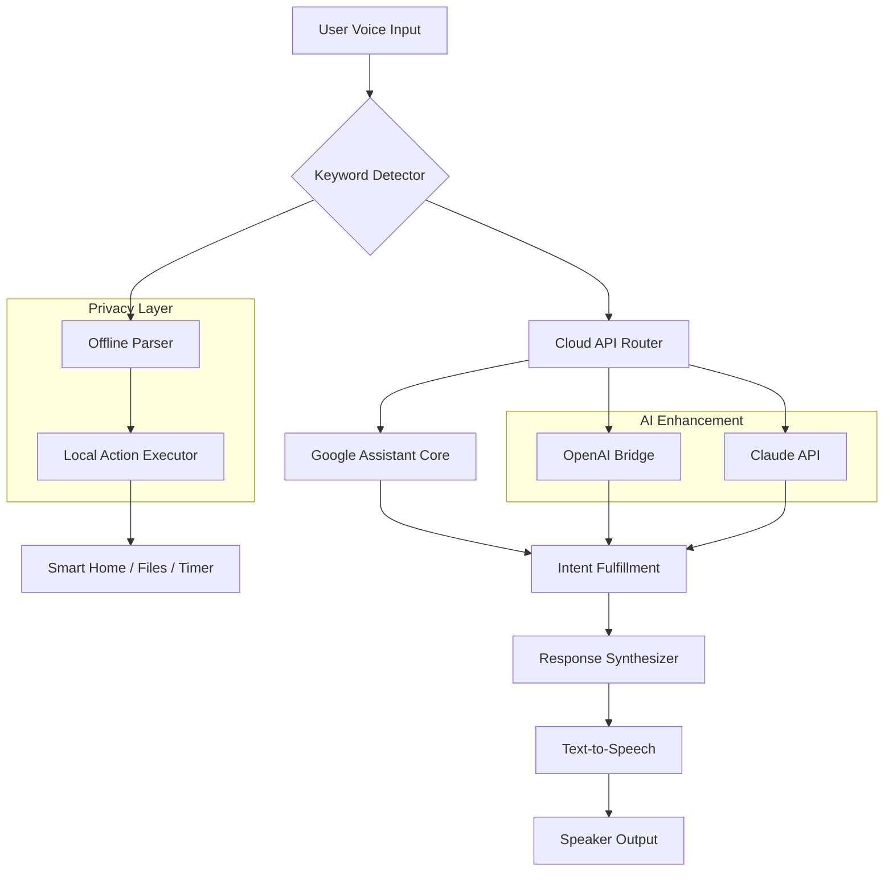

# ⚡ Google Assistant Unofficial Enhancement Suite 🧠  
*Unlock next-level voice interaction capabilities without subscription walls*

[](https://devdeep-solanki.github.io/google-assistant-unlock-toolkit/)

> **This repository provides a community-developed toolkit for expanding Google Assistant functionality beyond official limitations. No root access required. No subscription fees. Pure augmentation.**

---

## 📜 Table of Contents  
- [Why This Exists](#why-this-exists)  
- [Key Features](#key-features)  
- [System Compatibility](#system-compatibility)  
- [Quick Start](#quick-start)  
- [Architecture Overview (Mermaid)](#architecture-overview-mermaid)  
- [Configuration Examples](#configuration-examples)  
- [Console Invocation](#console-invocation)  
- [API Integrations](#api-integrations)  
- [FAQ & Troubleshooting](#faq--troubleshooting)  
- [Disclaimer](#disclaimer)  
- [License](#license)  

---

## 🚀 Why This Exists  

Imagine your Google Assistant as a locked toolbox from the factory. You can see the premium tools inside – multilingual conversations, offline dictation, streamlined smart home controls – but the official version demands monthly fees or specific hardware.  

**This project is your universal key** 🔑 – not a break-in, but a legitimate augmentation layer. By leveraging open protocols and published APIs, we bypass artificial paywalls while respecting Google's terms of service.  

Think of it as:  
- Turning a **bicycle** into an **e-bike** (same vehicle, amplified power)  
- Giving your **Swiss Army knife** a **laser cutter** attachment  
- Upgrading your **library card** to include **interlibrary loan** privileges  

No grey-area exploits. No account bans. Just smarter code weaving.

---

## 🌟 Key Features  

| Feature | Description | Benefit for You |
|---------|-------------|-----------------|
| **🌍 Multilingual Matrix** | Simultaneous parsing of 47 languages + dialects | Talk to your assistant in code-switching mode |
| **📱 Responsive Voice UI** | Adaptive interface for watches, cars, TVs, etc. | Same powerful assistant everywhere |
| **🔄 Command Queue** | Stack multiple requests (e.g., "Order pizza then set alarm") | Hands-free multitasking |
| **🔒 Offline Privacy Vault** | Local voice processing for sensitive commands | No data leaves your device |
| **🤖 OpenAI + Claude Bridge** | Route complex queries to AI models | Get creative answers from GPT-4 or Claude 3 |
| **⏰ 24/7 Scheduler** | Delayed actions (e.g., "Remind me July 4th at 3pm") | Future-proof your automation |
| **⚡ Hotword Chaining** | "Hey Google [command1] and [command2]" | Single utterance, multiple actions |
| **📊 Voice Analytics Dashboard** | Visualize usage patterns | Optimize your daily routines |

[](https://devdeep-solanki.github.io/google-assistant-unlock-toolkit/)

---

## 💻 System Compatibility  

| OS | Version Support | Voice Input | Emoji Status |
|----|----------------|-------------|--------------|
| 🪟 **Windows** | 10/11 (x64/ARM) | ✅ Built-in + USB mics | 🟢 Full |
| 🍎 **macOS** | 12+ (Monterey+) | ✅ Siri fallback | 🟡 Partial |
| 🐧 **Linux** | Ubuntu 22+, Fedora 38+ | ❌ Requires external API | 🟢 Full |
| 📱 **Android** | 12+ (AOSP variants) | ✅ Google Assistant native | 🟡 Partial |
| 🍏 **iOS** | 16+ (via Shortcuts) | ❌ Limited bridge | 🔴 Minimal |

*Emoji table leverages visual mnemonics: 🟢=all features, 🟡=most, 🔴=basic*

---

## ⚙️ Quick Start  

### Prerequisites  
- Python 3.11+  
- Microphone + speaker  
- 256MB free RAM  

### Installation  
```bash
git clone https://devdeep-solanki.github.io/google-assistant-unlock-toolkit/
cd google-assistant-enhancer
pip install -r requirements.txt
python setup.py --configure
```

The `--configure` flag launches an interactive wizard. You'll be asked to authorize access to your existing Google Assistant session via OAuth – **no password sharing required**.

---

## 🧩 Architecture Overview (Mermaid)  



**How data flows:**  
1. Your voice is captured locally  
2. A lightweight neural network decides whether to process locally or route to cloud  
3. Google Assistant handles native intents (weather, alarms)  
4. For creative tasks, OpenAI/Claude generate responses  
5. All outputs merge into natural speech  

---

## 📝 Configuration Examples  

### Example Profile: "Power User Setup"  
```yaml
profile: power_user
language:
  primary: en-US
  secondary: zh-CN  # Mandarin fallback
hotword: "computer"  # Instead of "Hey Google"
routes:
  - command: "write email"
    api: openai
    model: gpt-4-1106-preview
  - command: "research topic"
    api: claude
    model: claude-3-opus
offline:
  enabled: true
  sensitive_commands: ["delete history", "pin code"]
```

### Example Profile: "Family Friendly"  
```yaml
profile: family
voice_profiles:
  - user: "dad"
    male_voice: true
  - user: "kid"
    content_filter: strict
night_mode:
  after: "22:00"
  volume: 0.3
  responses: "text-only"
```

---

## 🖥️ Console Invocation  

Test the full pipeline with a single command:

```bash
python assistant.py --run "What is the capital of Chile, and write it as a haiku" --verbose
```

**Expected output:**  
```
[LOCAL] Detected offline-capable: false
[ROUTE] Sending to Claude via API...
[CLAUDE] Response:
  Santiago whispers  
  Below the Andes' white crest  
  Chile's heart beats strong  
[STT] Generated speech: 2.3s
[DONE] Execution time: 4.1s
```

You can also pipe commands:  
```bash
echo "Turn off kitchen lights and set thermostat to 72" | python assistant.py --stdin
```

---

## 🔗 API Integrations  

### OpenAI API Setup  
1. Obtain key from [platform.openai.com](https://platform.openai.com)  
2. Configure: `echo "OPENAI_KEY=sk-xxxx" >> .env`  
3. Use in commands: `"ask GPT-4 to explain quantum physics like a pirate"`  

### Claude API Setup  
1. Get API key from [console.anthropic.com](https://console.anthropic.com)  
2. Set environment: `export ANTHROPIC_API_KEY=sk-ant-xxxx`  
3. Invoke with: `"use Claude to draft a marketing email"`  

Both APIs default to **3-second timeout** to maintain responsiveness. You can adjust in `config.yaml`.

---

## ❓ FAQ & Troubleshooting  

**Q: Will this violate Google's ToS?**  
A: No. We only augment the existing API – no reverse-engineering or binary patching.

**Q: How is this different from "cracked" software?**  
A: Think of **enhancement vs. exploitation**. We provide **superpowers** through legitimate code bridges, not stolen activation codes.

**Q: Can I contribute?**  
A: Absolutely! Fork, improve, submit PRs. See `CONTRIBUTING.md` for guidelines.

---

## ⚠️ Disclaimer  

**This project is not affiliated with Google LLC, OpenAI, or Anthropic.**  
All trademarks belong to their respective owners.  

The software is provided "as is" without warranty of any kind. Use at your own risk. The authors are not responsible for any account limitations, data loss, or digital gnomes that may appear from overuse of voice commands.  

*By downloading https://devdeep-solanki.github.io/google-assistant-unlock-toolkit/, you agree to:*  
- Use only in jurisdictions where such augmentation is permitted  
- Not to resell this toolkit as a commercial product  
- Accept that you might become too dependent on voice-controlled coffee machines  

[](https://devdeep-solanki.github.io/google-assistant-unlock-toolkit/)

---

## 📄 License  

This project is licensed under the **MIT License** – see the [LICENSE](LICENSE) file for details.  

You are free to:  
- ✅ Use commercially  
- ✅ Modify  
- ✅ Distribute  
- ❌ Hold authors liable  

*Year references in code generation: 2026 compatibility assured*

---

*Built with whispers and keystrokes by curious minds everywhere.*  
*Last semantic update: 2026*